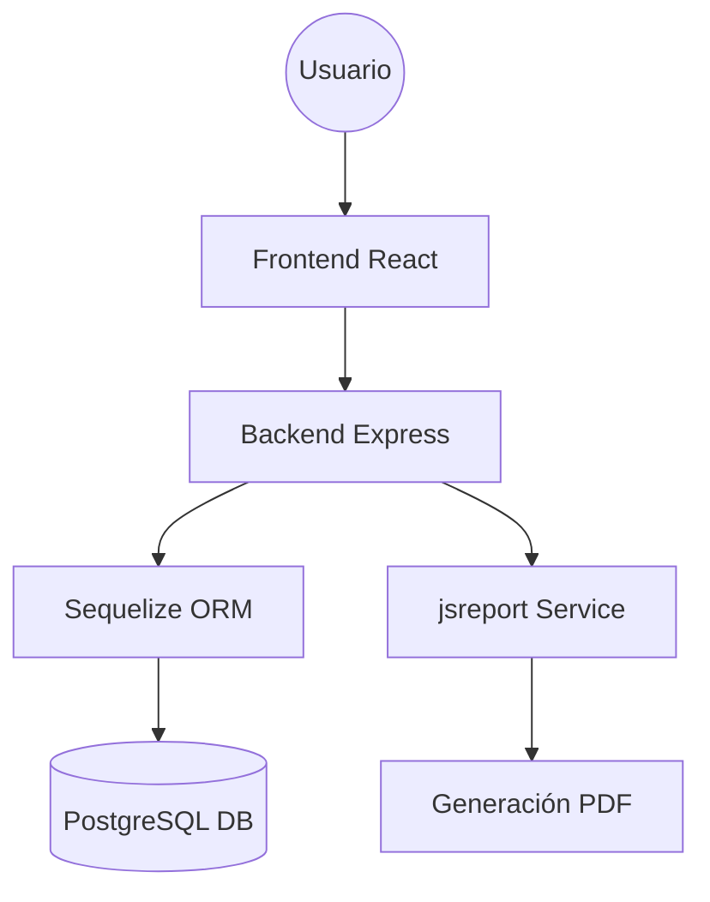
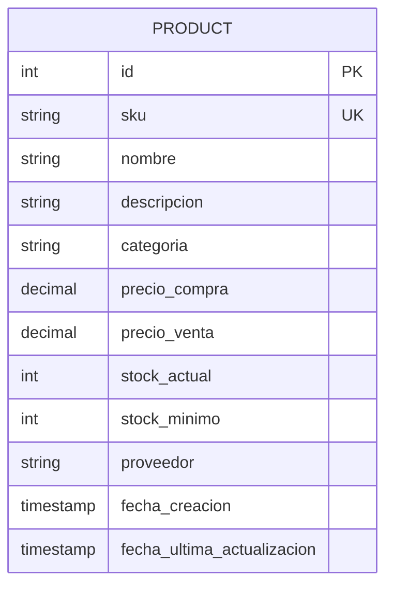

# Sistema de Gestión de Productos (StockMaster)

Este es un sistema integral de gestión de inventarios diseñado para pequeñas y medianas empresas (PYMES). Permite el control total de productos, análisis de rendimiento mediante un dashboard interactivo y la generación de reportes operativos y de gestión en PDF.

## 🚀 Arquitectura del Sistema

El sistema sigue una arquitectura de **Cliente-Servidor (SPA)**:

1.  **Frontend**: Una aplicación de página única (SPA) construida con **React**. Utiliza **Tailwind CSS** para un diseño moderno y responsivo, y **Recharts** para la visualización de datos.
2.  **Backend**: Una API RESTful construida con **Node.js** y **Express**. Gestiona la lógica de negocio y la persistencia de datos.
3.  **Base de Datos**: **PostgreSQL** para el almacenamiento relacional, gestionado a través del ORM **Sequelize**.
4.  **Reportes**: Utiliza **jsreport** para la generación de documentos PDF profesionales a partir de plantillas HTML.

### Flujo de Datos
- El usuario interactúa con la interfaz de React.
- React realiza peticiones HTTP (vía Axios) al servidor Express.
- Express valida la petición, interactúa con PostgreSQL vía Sequelize.
- Los datos se devuelven al cliente en formato JSON o como un stream de PDF.

## 🛠️ Tecnologías Utilizadas

- **Frontend**: React 18, TailwindCSS, Recharts, Lucide Icons, Headless UI.
- **Backend**: Node.js, Express, Sequelize, PostgreSQL.
- **Reportes**: jsreport.
- **Validación**: express-validator.

## 📋 Requisitos Previos

- Node.js (v16 o superior)
- PostgreSQL (v12 o superior)
- npm o yarn

## ⚙️ Instalación y Configuración

### 1. Clonar el repositorio
```bash
git clone <url-del-repositorio>
cd product-management
```

### 2. Configuración de la Base de Datos
- Crea una base de datos en PostgreSQL llamada `product_management`.
- Ejecuta el script inicial: `psql -U postgres -d product_management -f database/init.sql`.

### 3. Configurar el Backend
```bash
cd backend
npm install
```
- Crea un archivo `.env` en la carpeta `backend/` basándote en el archivo `.env.example` o usa los valores por defecto si coinciden con tu instalación de Postgres.

### 4. Configurar el Frontend
```bash
cd ../frontend
npm install
```

## 🏃 Ejecución

### Iniciar Backend (Puerto 5000)
```bash
cd backend
npm run dev
```

### Iniciar Frontend (Puerto 3000)
```bash
cd frontend
npm start
```

---

## 📊 Diagramas

### Arquitectura de Solución


### Modelo de Datos (ERD)


## 📝 Decisiones de Diseño

- **Sequelize vs Otros ORMs**: Se eligió Sequelize por su madurez, excelente soporte para PostgreSQL y facilidad para definir hooks (como la actualización automática de `fecha_ultima_actualizacion`).
- **Tailwind CSS**: Permite un desarrollo rápido de interfaces consistentes y profesionales sin escribir CSS personalizado extenso.
- **jsreport**: Ofrece una flexibilidad superior para diseñar reportes complejos usando estándares web (HTML/CSS), lo que facilita el mantenimiento comparado con librerías que dibujan directamente sobre el canvas del PDF.
